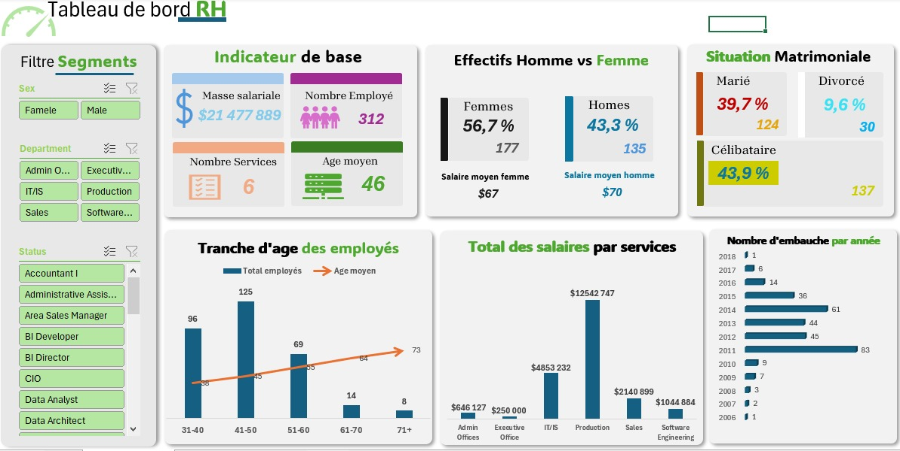
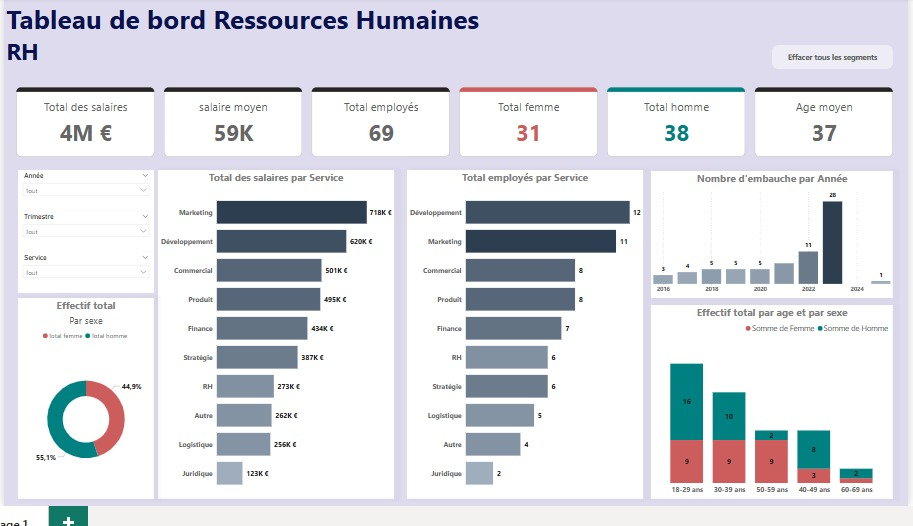
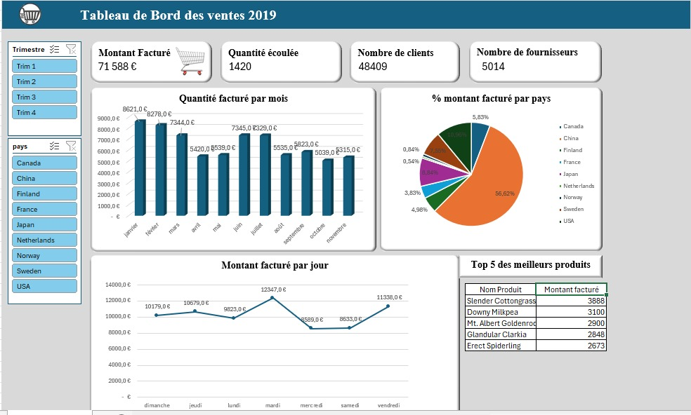

📊 Tableau de bord RH – Analyse des Ressources Humaineset analyse de ventes
Ce projet regroupe plusieurs tableaux de bord interactifs réalisés dans le cadre de l’analyse des Ressources Humaines 
et des ventes de l’année 2019. Ils permettent de visualiser des indicateurs clés pour la prise de décision stratégique.

🔍 Objectifs
- Suivre les indicateurs RH de manière dynamique
- Analyser la répartition des salaires par service
- Visualiser l’évolution des embauches dans le temps
- Comprendre la structure démographique de l’entreprise (âge, sexe, statut matrimonial)

## 🧍 Tableau de bord RH – Excel

Principales fonctionnalités :
- Filtres dynamiques (sexe, département, statut)
- Indicateurs : masse salariale, nombre d’employés, âge moyen
- Comparaison Homme vs Femme (effectif, salaire moyen)
- Répartition par situation matrimoniale
- Tranche d’âge des employés
- Total des salaires par service
- Nombre d’embauches par année
  

## 📈 Tableau de bord RH – Power BI

Principales fonctionnalités :
- Indicateurs clés : total salaires, salaire moyen, effectifs, âge moyen
- Répartition des salaires et des effectifs par service
- Visualisation par sexe et par tranche d’âge
- Nombre d’embauches par année
- Graphiques interactifs pour filtrer par année, trimestre et service

## 💰 Tableau de bord des ventes 2019 – Excel

### 🔹 Fonctionnalités :
- Montant facturé  | Quantité écoulée 
- Nombre de clients  | Fournisseurs 
- Quantité facturée par mois et par jour
- Répartition des montants facturés par pays (camembert)
- Top 5 des produits les plus facturés

  
## 🛠️ Outils utilisés

- **Microsoft Excel, Power Query et Power pivot** (tableaux croisés dynamiques, slicers, graphiques interactifs)
- **Power BI** (visualisation dynamique, DAX, modélisation de données)
  
